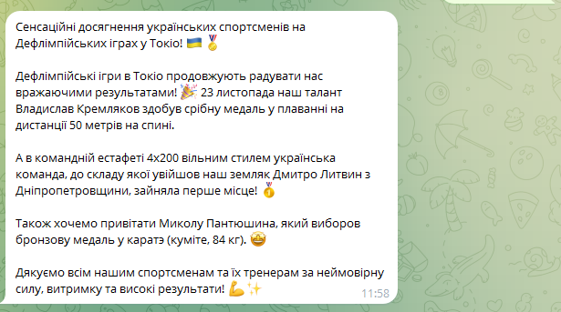

# mssg
MSSG (Multilingual Sentiment Scraper Generator) - Modular Monolith AI-Powered positive News Generator (local XLM-RoBERTa, LLM) for TG-bot.

# VALUE PROPOSITION

## Multilingual Analysis
Supports news analysis in RU, UK, and EN.

## Semantic Deduplication
Uses a vector database (ChromaDB) to filter out articles with similar meanings, ensuring unique content.

## AI Rewriting
Uses the LLM API for automatic translation, sentiment change (from neutral/negative to positive), and formatting of posts for Telegram.

## Automated Cycle
A fully autonomous script for parsing, processing, and publishing.

# DEPLOY AND USAGE
Clone repo:

    git clone https://github.com/hnedenko/mssg.git

Setup in .env file in .venv folder your own parameters like:

    OPENAI_API_KEY = ""
    TELEGRAM_BOT_TOKEN = ""
    TELEGRAM_CHAT_ID = ""

Run app

    python maim.py

The program should automatically install all the necessary libraries and models when first launched.

Each time the program is run, it receives new articles, processes them, publishes them, and stopped.

# TECH STACK

## NLP/AI
Hugging Face Transformers (XLM-RoBERTa), sentence-transformers

## LLM API
OpenAI (for rewriting and translation)

## Vector Database
ChromaDB

## Other 
python-telegram-bot, asyncio, python-dotenv

# MODULES
## RSSParser
Parses the configured list of sites with RSS feeds and obtains a list of new article titles.

Output:

    "title":"Нові перемоги дніпропетровських спортсменів на Дефлімпійських іграх у Токіо",

    "link":"https://gorod.dp.ua/news/250901",

    "published_time":"Mon, 24 Nov 2025 11:00:09 +0200"

## DataManager

Performs all operations with the chromadb vector database, with two collections: for all articles and only for those published on the channel (positive and unique).

Contains methods:

- is_article_id_unique_in_main()
- is_article_semantics_unique_in_positivity_articles()
- add_article_in_main()
- add_article_in_positivity_articles()

## HTMLScraper

Gets the HTML code of the page from the link.

Parse the text of the main article from the HTML code of the entire page.

Input:

    "link":"https://gorod.dp.ua/news/250901"

Output:

    "origin_text":"Дефлимпийские игры в Токио продолжаются. Наши спортсмены снова показывают крутые результаты. 23 ноября в плавании Владислав Кремляков завоевал серебро на дистанции 50 метров на спине. В командной эстафете 4х200 вольным стилем первое место занял украинский состав, в котором Днепропетровщину представил Дмитрий Литвин. В каратэ (кумите, 84 кг) Николай Пантюшин завоевал бронзу. Спасибо всем нашим спортсменам и их тренерам за силу, выдержку и высокие результаты!"

## Vectorizer

Translates text into a 768-dimensional vector

Sentence Transformers multilingual model
"paraphrase-multilingual-mpnet-base-v2"

Input:

    "rewrite_text":"Сенсаційні досягнення українських спортсменів на Дефлімпійських іграх у Токіо! 🇺🇦🏅Дефлімпійські ігри в Токіо продовжують радувати нас вражаючими результатами! 🎉 23 листопада наш талант Владислав Кремляков здобув срібну медаль у плаванні на дистанції 50 метрів на спині.А в командній естафеті 4х200 вільним стилем українська команда, до складу якої увійшов наш земляк Дмитро Литвин з Дніпропетровщини, зайняла перше місце! 🥇Також хочемо привітати Миколу Пантюшина, який виборов бронзову медаль у каратэ (куміте, 84 кг). 🤩Дякуємо всім нашим спортсменам та їх тренерам за неймовірну силу, витримку та високі результати! 💪✨"

Output:

    "vector":[-0.02057516 -0.08275953 -0.01531441  0.07294445  0.1750323 ...]

## PositivityAnalyser

Similar to the previous one, it translates the text into a 3-dimensional vector, with assessments of its degree
(negativity, neutrality, positivity)

Sequence Classification multilingual model
"camiloajt/xlmr-sentiment-es"

Input:

    "rewrite_text":"Сенсаційні досягнення українських спортсменів на Дефлімпійських іграх у Токіо! 🇺🇦🏅Дефлімпійські ігри в Токіо продовжують радувати нас вражаючими результатами! 🎉 23 листопада наш талант Владислав Кремляков здобув срібну медаль у плаванні на дистанції 50 метрів на спині.А в командній естафеті 4х200 вільним стилем українська команда, до складу якої увійшов наш земляк Дмитро Литвин з Дніпропетровщини, зайняла перше місце! 🥇Також хочемо привітати Миколу Пантюшина, який виборов бронзову медаль у каратэ (куміте, 84 кг). 🤩Дякуємо всім нашим спортсменам та їх тренерам за неймовірну силу, витримку та високі результати! 💪✨"

Output:

    "positivity":(0.00412802305072546, 0.026627033948898315, 0.9692450165748596)

## LLMRouter

Connects to OpenAI "gpt-4o-mini" and obtains a short, paragraph-based, more positive Ukrainian news text from the full text of a news story in any language of any length.

Input:

    "origin_text":"Дефлимпийские игры в Токио продолжаются. Наши спортсмены снова показывают крутые результаты. 23 ноября в плавании Владислав Кремляков завоевал серебро на дистанции 50 метров на спине. В командной эстафете 4х200 вольным стилем первое место занял украинский состав, в котором Днепропетровщину представил Дмитрий Литвин. В каратэ (кумите, 84 кг) Николай Пантюшин завоевал бронзу. Спасибо всем нашим спортсменам и их тренерам за силу, выдержку и высокие результаты!"

Output:

    "rewrite_text":"Сенсаційні досягнення українських спортсменів на Дефлімпійських іграх у Токіо! 🇺🇦🏅Дефлімпійські ігри в Токіо продовжують радувати нас вражаючими результатами! 🎉 23 листопада наш талант Владислав Кремляков здобув срібну медаль у плаванні на дистанції 50 метрів на спині.А в командній естафеті 4х200 вільним стилем українська команда, до складу якої увійшов наш земляк Дмитро Литвин з Дніпропетровщини, зайняла перше місце! 🥇Також хочемо привітати Миколу Пантюшина, який виборов бронзову медаль у каратэ (куміте, 84 кг). 🤩Дякуємо всім нашим спортсменам та їх тренерам за неймовірну силу, витримку та високі результати! 💪✨"

## TelegramBot

Manages the created Telegram bot and sends a text post with news to the chat on its behalf.

Input:

    "rewrite_text":"Сенсаційні досягнення українських спортсменів на Дефлімпійських іграх у Токіо! 🇺🇦🏅Дефлімпійські ігри в Токіо продовжують радувати нас вражаючими результатами! 🎉 23 листопада наш талант Владислав Кремляков здобув срібну медаль у плаванні на дистанції 50 метрів на спині.А в командній естафеті 4х200 вільним стилем українська команда, до складу якої увійшов наш земляк Дмитро Литвин з Дніпропетровщини, зайняла перше місце! 🥇Також хочемо привітати Миколу Пантюшина, який виборов бронзову медаль у каратэ (куміте, 84 кг). 🤩Дякуємо всім нашим спортсменам та їх тренерам за неймовірну силу, витримку та високі результати! 💪✨"

Output:

